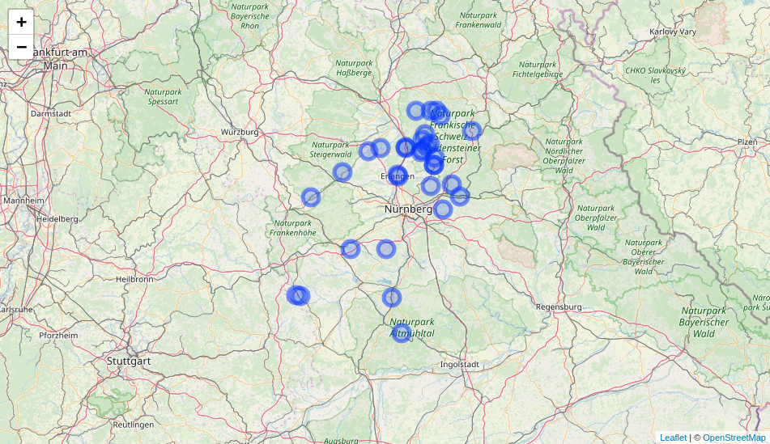
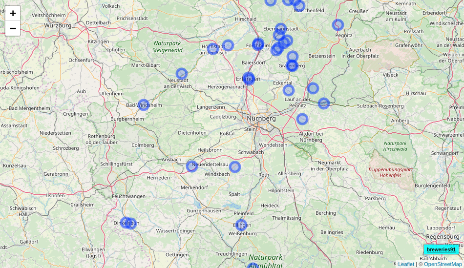
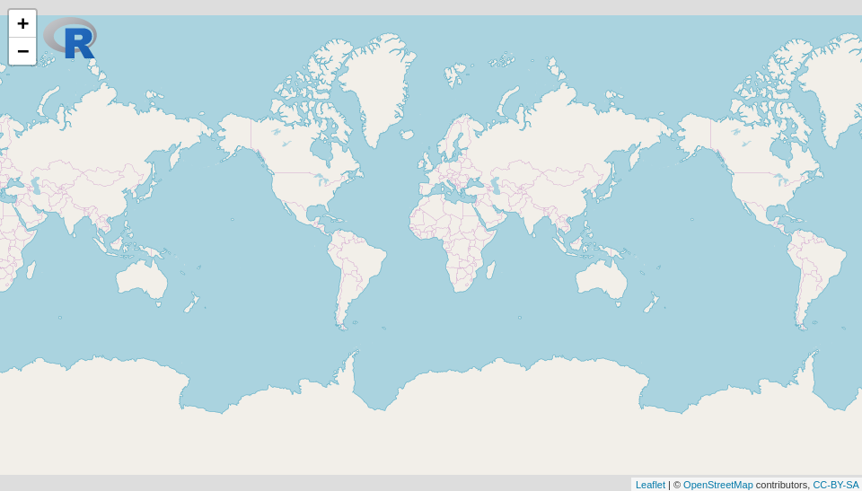

<!-- README.md is generated from README.Rmd. Please edit that file -->

# leafem - leaflet extensions for mapview

[](https://cran.r-project.org/web/checks/check_results_leafem.html)
[](https://travis-ci.org/r-spatial/leafem)
[](https://www.rpackages.io/package/leafem)
[](https://www.rpackages.io/package/leafem)
[](https://cran.r-project.org/package=leafem)
[](https://CRAN.R-project.org/package=leafem)

`leafem` provides extensions for package `leaflet` many of which are
used by package `mapview`. The intention of this package is to enhance
`leaflet` functionality to provide a more GIS-like feeling when plotting
spatial data interactively.

## Installation

You can install the released version of leafem from
[CRAN](https://CRAN.R-project.org) with:

``` r
install.packages("leafem")
```

## Extensions

#### addFeatures

``` r
library(leaflet)

leaflet() %>% addProviderTiles("OpenStreetMap") %>% addFeatures(data = breweries91)
```



#### addMouseCoordinates

``` r
leaflet() %>%
  addProviderTiles("OpenStreetMap") %>%
  addMouseCoordinates()
```


#### garnishMap

``` r
library(leaflet)

m <- leaflet() %>% addProviderTiles("OpenStreetMap")
garnishMap(m, addMouseCoordinates)
```


#### addHomeButton

``` r
library(leaflet)
library(raster)

m <- leaflet() %>%
  addProviderTiles("OpenStreetMap") %>%
  addCircleMarkers(data = breweries91) %>%
  addHomeButton(extent(breweries91), "breweries91")
m
```



#### addImageQuery

``` r
library(leaflet)
library(plainview)

leaflet() %>%
  addProviderTiles("OpenStreetMap") %>%
  addRasterImage(poppendorf[[1]], project = TRUE, group = "poppendorf",
                 layerId = "poppendorf") %>%
  addImageQuery(poppendorf[[1]], project = TRUE,
                layerId = "poppendorf") %>%
  addLayersControl(overlayGroups = "poppendorf")
```


#### addLogo

``` r
img <- "https://www.r-project.org/logo/Rlogo.svg"

leaflet() %>% addTiles() %>% addLogo(img, url = "https://www.r-project.org/logo/")
```



### Code of Conduct

Please note that the ‘leafem’ project is released with a [Contributor
Code of Conduct](https://github.com/r-spatial/leafem/blob/master/CODE_OF_CONDUCT.md). By participating in this project you agree to abide by its terms.
